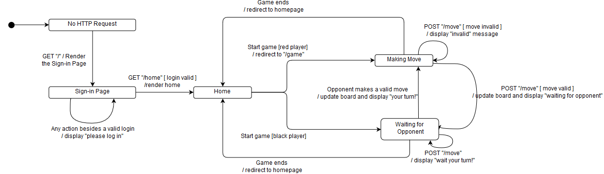

# PROJECT Design Documentation

> _The following template provides the headings for your Design
> Documentation.  As you edit each section make sure you remove these
> commentary 'blockquotes'; the lines that start with a > character
> and appear in the generated PDF in italics._

## Team Information
* Team name: 11D
* Team members
  * Nick Sander
  * John Knecht
  * Shannon Quinn
  * Zeke Miller
  * Spencer Fleming

## Executive Summary

This WebCheckers application implements the Java Spark framework to provide the user with a game of checkers againsted other signed in users. To play, a user must sign in with a unique username and select or get selected by another user who is not currently in a game. The application also provides an A.I. player for the user to play against.

### Purpose
> Connect players from across the globe and allow them to play a game of checkers.  WebCheckers is meant to provide an easy to use interface by which players can easily play checkers against anyone else that is signed in at the time, or an AI opponent. With our hint feature, individuals can receive help in their checkers game.

### Glossary and Acronyms
> _Provide a table of terms and acronyms._

| Term | Definition |
|------|------------|
| VO | Value Object |

## Requirements

This section describes the features of the application.

> _In this section you do not need to be exhaustive and list every
> story.  Focus on top-level features from the Vision document and
> maybe Epics and critical Stories._

### Definition of MVP
	The MVP of Web Checkers allows players to sign in, choose a username, play a game of American
checkers against their chosen opponent, resign from a game and sign out when they are
finished playing.

### MVP Features
> 

### Roadmap of Enhancements
> _Provide a list of top-level features in the order you plan to consider them._

## Application Domain

This section describes the application domain.

> The domain itself for a game of checkers is fairly simple.  Each game being played is played on a single board by two players (or a Player and an AIplayer).  Each player controls 12 pieces of a given color (at the start), which are placed in a pattern on the 64 Squares on the Board.

## Architecture and Design

This section describes the application architecture.

### Summary

The following Tiers/Layers model shows a high-level view of the webapp's architecture.

As a web application, the user interacts with the system using a
browser.  The client-side of the UI is composed of HTML pages with
some minimal CSS for styling the page.  There is also some JavaScript
that has been provided to the team by the architect.

The server-side tiers include the UI Tier that is composed of UI Controllers and Views.
Controllers are built using the Spark framework and View are built using the FreeMarker framework.  The Application and Model tiers are built using plain-old Java objects (POJOs).

Details of the components within these tiers are supplied below.

### Overview of User Interface

This section describes the web interface flow; this is how the user views and interacts
with the WebCheckers application.

> The interface consists of a few main pages, with a few extra states to represent the user's game status and sign in status, for example.  The user starts off disconnected, then is prompted to sign in.  Once the user signs in, they can either begin a game or wait to be challenged.  The red player is prompted to make a move, while the black player waits for his/her opponent to take their turn.  Once the current player makes their move, the two players swap states, with the other player making their turn while the previous player once again waits.

### UI Tier

Once upon a time our UI tier handled HTTP requests from server. It allowed users
to think that webcheckers was the work of blak magic (which it is, but that is a story for 
another time). Users could willingly sign into and sign out of Web Checkers if it did not destroy their 
soul in the process. They can chose to play with another Player, or against an AI opponent. It handled refreshing the page constanly to update to see if it was a user's turn in
the game, which is where the Javascript reared it's ugly head. It also allowed users to undo their moves and submit 
their moves by sending unconventionally gross enums. It also handles removing users from a game if a player resigns or if a player wins. If they win they get a cookie. A poisoned cookie. 

### Application Tier

The application tier includes the classes GameCenter and PlayerLobby.
When the server is started then we create an instance of GameCenter that holds a PlayerLobby.
PlayerLobby will hold all of the players currently signed into Web Checkers. PlayerLobby takes care of username validation. GameCenter handles the creation of games and validation of games. It will not allow a player to be in more than one game. 

### Model Tier

Model Tier handles all of the actual game logic. It has a game class that maintains the state of a Board an two Players(one could be an AIPlayer), in order to keep state protected but also will allow moves to be undone. The board has a state of it's own to keep track of the current turn, and a list of rows that make up the actual board. Each row has a list of spaces that make up the row itself. Each space can be marked invalid or valid and if it contains a piece. A piece have a type (single, king) and color (red, white) and a state(open, blocked, jump). Open means no jumps available, but there is a single step to be made. A blocked piece means it currently can not make a move. Jump is used when there is jump is available to make. These states are used to help make determining legal moves for the game more convenient. Position and Move are both data holders which are used for checking when a move is a step or jump.

### Design Improvements
If the project were to continue, we would change the info and error enums to be
capitalized as it was intended to be. We would also nuke all of the javascript 
and start from scratch. 

## Testing
### Acceptance Testing

Currently, all stories fully pass their acceptance criteria tests.
We don't have any concerns about the tests that we have checked. We are all concerned for our mental well being though.

### Unit Testing and Code Coverage
Our unit testing strategy was to get as many lines covered as possible. We used Mocktio to help us create mock objects. Currently our code is covered at 91%. We were planning on aiming for 80% coverage in the UI class, but we managed to get 90% coverage.  We aimed for 95% coverage in the application tier, which was accomplished 
with ease. The coverage in model tier is close to the 95% coverage goal at 94%. Our model tier is 
still a work in progress, so we should be able to accomplish our goal of 95% at the end of Sprint 3 with no problem.

